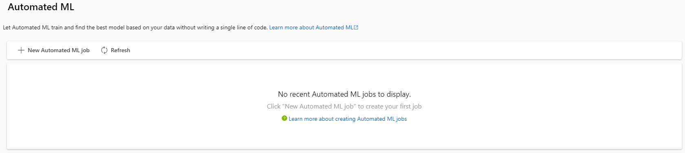
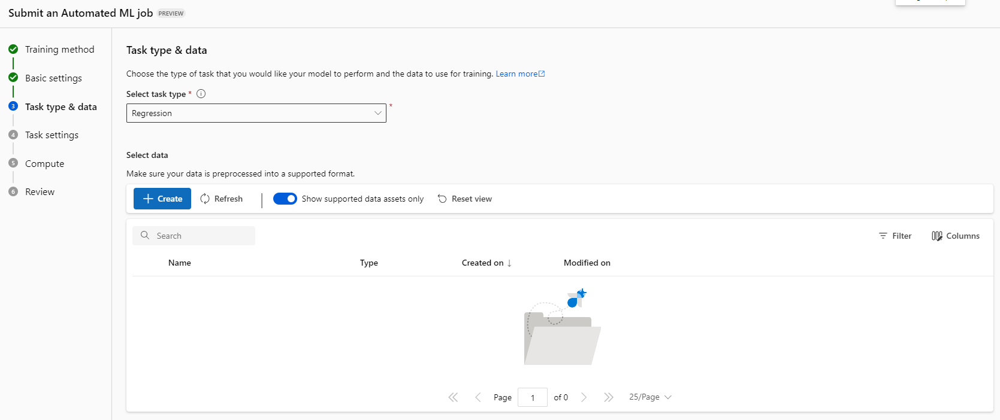
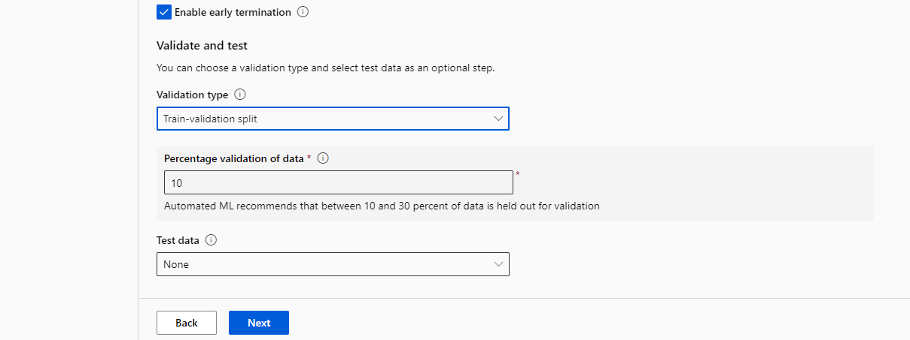
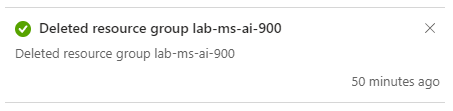

# Explorando a criação de modelo automático usando o Azure Machine Learning

## Proposta

Criar um modelo de previsão com seus devidos pontos de extremidade configurados. Descrever o passo a passo desse processo. Usar uma arquivo .json no ponto de extremidade para obter uma previsão do modelo.

## Passo a passo

Vamos seguir a documentação do Microsoft Learn e ao longo do texto serão feitos comentários sobre o processo para esclarecer possíveis dúvidas. A referencia principal é a documentação:

- [Explore Automated Machine Learning in Azure Machine Learning - Microsoft Learn](https://microsoftlearning.github.io/mslearn-ai-fundamentals/Instructions/Labs/01-machine-learning.html)

Antes de começar é importante notar que para seguir esse passo a passo é necessário configurar uma conta no Microsoft Azure e criar um workspace.
Para tal, a seguinte lista lista de recursos pode ser usada como guia:

- [Criar serviços incluídos com a conta gratuita do Azure](https://learn.microsoft.com/pt-br/azure/cost-management-billing/manage/create-free-services).
- [O que é um workspace do Azure Machine Learning?](https://learn.microsoft.com/pt-br/azure/machine-learning/concept-workspace?view=azureml-api-2)
- [Explore Azure AI Services](https://microsoftlearning.github.io/mslearn-ai-fundamentals/Instructions/Labs/02-content-safety.html)

### Criação do modelo

Dentro da conta Azure, deve-se acessar e criar o recurso **Azure Machine Learning** usando as informações fornecidas na documentação. Nota-se que o recurso é criado dentro de um workspace que devemos acessar posteriormente para poder utilizar o recurso criado.

### Treinamento automático do modelo

Isso finaliza a criação e inicialização do recurso. Agora, deve-se iniciar o workspace **laboratorioai** (acessível pela página anterior ou utilizando a seção All workspaces) e acessar o ambiente Automated ML. Desse ambiente iremos criar e submeter um novo trabalho utilizando as informações contidas na documentação.

Isso finaliza o processo de criação do modelo de machine learning automático. Podemos fazer alguns comentários sobre esse processo.

- O tipo de tarefa é de regressão pois estamos montando um modelo que utilize os dados para predizer uma quantidade numérica;
- Os dados são obtidos de um arquivo da web, esse processo é simplificado no caso do Microsoft Azure onde podemos trabalhar os dados diretamente no ambiente quando importamos a database;
- A configuração da tarefa permite definir os tipos de modelos de regressão a serem treinados. Os modelos escolhidos são de [RandomForest](https://en.wikipedia.org/wiki/Random_forest) e [LightGBM](https://en.wikipedia.org/wiki/LightGBM). Além disso, hyperparameters e tipo de validação cruzada são definidos nessa parte.
- Esse processo simplifica a criação de um pipeline para ajustes de hyperparameters entre diferentes modelos e é dado como resultado o melhor modelo (segundo a métrica escolhida) e dentro das limitações impostas (como tempo de treinamento, modelos a serem utilizados, etc.).

### Utilização do modelo

A próxima parte refere-se ao deployment do modelo usando um serviço web para que possamos fazer predições utilizando o modelo. Isso cria um ponto de extremidade para que possamos utilizar o modelo remotamente. Fazendo esse processo (seguindo novamente a documentação) tem-se.

Aqui entremos na parte de test para inserir os dados para obtermos uma predição segundo o modelo. Os dados e o resultado obtido são:

Note que os dados são "enviados" no formato json e o serviço responde usando a mesma estrutura. Por fim, deve-se deletar todos os recursos que não serão mais utilizados.

