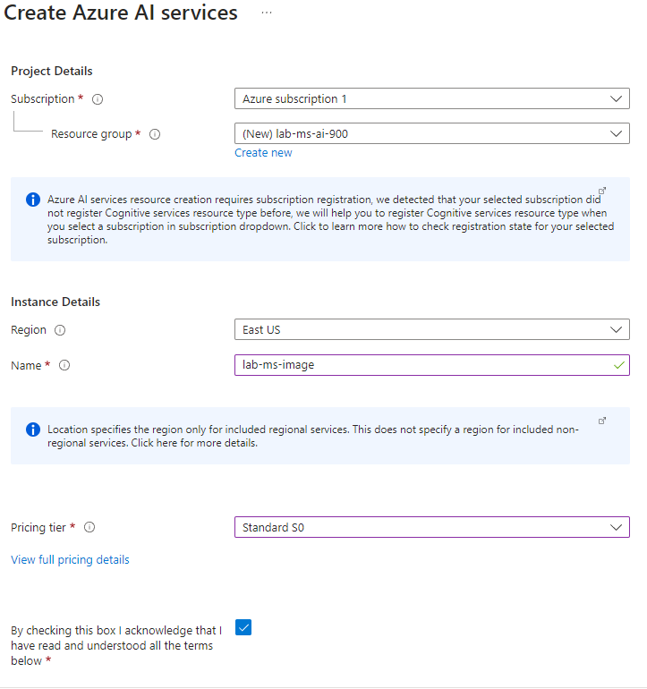
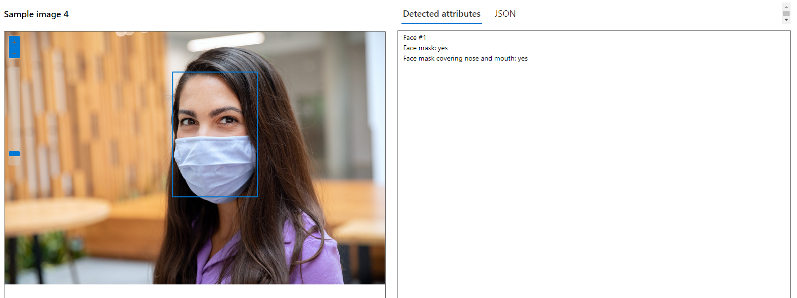

# Explorando o Vision Studio da Azure

## Proposta

Utilização do recurso Vision Studio da Azure para realizar diferentes tarefas de analise de imagens. As tarefas são:

- Adicionar legenda baseado no conteúdo da imagem. Para o principal elemento e para todos os elementos;
- Extrair texto da imagem (OCR - optical character recognition);
- Detecção automática de rostos em imagens.

## Passo a passo

Vamos seguir a documentação do Microsoft Learn e ao longo do texto serão feitos comentários sobre o processo para esclarecer possíveis dúvidas. A referencia principal é a documentação:

- [Detect faces in Vision Studio](https://microsoftlearning.github.io/mslearn-ai-fundamentals/Instructions/Labs/04-face.html)
- [Read text in Vision Studio](https://microsoftlearning.github.io/mslearn-ai-fundamentals/Instructions/Labs/05-ocr.html)
- [Analyze images in Vision Studio](https://microsoftlearning.github.io/mslearn-ai-fundamentals/Instructions/Labs/03-image-analysis.html)

Antes de começar é importante notar que para seguir esse passo a passo é necessário configurar uma conta no Microsoft Azure e criar um workspace.
Para tal, a seguinte lista lista de recursos pode ser usada como guia:

- [Criar serviços incluídos com a conta gratuita do Azure](https://learn.microsoft.com/pt-br/azure/cost-management-billing/manage/create-free-services).
- [O que é um workspace do Azure Machine Learning?](https://learn.microsoft.com/pt-br/azure/machine-learning/concept-workspace?view=azureml-api-2)
- [Explore Azure AI Services](https://microsoftlearning.github.io/mslearn-ai-fundamentals/Instructions/Labs/02-content-safety.html)

### Ativando o Vision Studio

Vamos começar criando o recurso **Azure AI services**. Os passos a seguir são relacionados à essa tarefa e as informações a serem inseridas estão na documentação.

### Acessar o recurso Vision Studio

Agora que temos o **Azure AI services** ativado podemos acessar o recurso **Vision Studio** (que funciona de forma similar ao workspace do laboratório 1) através do link [https://portal.vision.cognitive.azure.com/?azure-portal=true](https://portal.vision.cognitive.azure.com/?azure-portal=true). Aqui precisamos selecionar o nosso recurso criado na parte anterior, isso permitirá utilizar os diferentes recursos do **Vision Studio**.

Com isso pronto podemos explorar diferentes funcionalidades do **Vision Studio**.

### Reconhecimento de elementos na imagem

Podemos reconhecer automaticamente objetos que estão na imagem utilizando o recurso "Add captions to images" dentro de "Image analysis".

Vamos testar duas imagens distintas para mostrar o recurso e falar sobre as limitações. Primeiro vamos inserir uma imagem comum de uma pessoa utilizando um skate.

Vemos que o modelo foi capaz de corretamente descrever o principal elemento da imagem como "A man jumping on a skateboard". Podemos testar o modelo com uma imagem mais exotica.

Aqui temos que o modelo não soube definir corretamente o elemento principal como um minotauro mas fez uma descrição bastante próxima como "A man in armor with horns and an ax". O modelo identificou corretamente o machado, que é um elemento mais comum.

Isso nos leva à conclusão que o modelo foi treinado utilizando imagens de elementos mais comuns, isso é esperado de modelos genéricos de reconhecimento de imagens. Se quisermos que o modelo identifique corretamente elementos fora do comum devemos inserir essas informações na database e retreinar o modelo ou utilizar a técnica de "transfer learning" onde utilizamos a parte do modelo já treinado e apenas modificamos a parte final de identificação de objetos. Veja mais informações sobre isso em [Transfer learning](https://en.wikipedia.org/wiki/Transfer_learning).

Outro recurso, acessado via "add dense caption to images", é similar e permite tentar identificar todos os elementos dentro de uma imagem. A utilização desse recurso é descrita nas imagens a seguir.

Podemos ver que muitos elementos foram corretamente categorizados mas outros estão completamente errados (o modelo identificou um rostos que claramente não consta na imagem). Isso mostra mais uma vez que o reconhecimento de imagens depende fortemente dos dados de treinamento, é necessários escolher um modelo treinado de forma apropriada para a tarefa.

### Extração de texto OCR - optical character recognition

A próxima tarefa é utilizar a "Extract text from images" da parte "optical character recognition" para extrair textos automaticamente de imagens. 

Iremos testar o reconhecimento com duas imagens distintas.

Podemos ver que a primeira imagem (da cerveja) houve um reconhecimento perfeito do texto. Na segunda imagem, que é de uma lista de exercícios de mecânica quântica, houve um bom reconhecimento dos elementos mas as formulas matemáticas não foram transcritas de forma exata. Isso é esperado pois o modelo é voltado para textos genéricos, caracteres especiais, utilizados em física e matemática, parecem necessitar de modelos específicos. Isso é similar ao caso anterior.

### Detecção de rostos em imagens

Outro recurso existente é o de detectar e descrever alguns elementos de rostos em imagens. Seguindo o mesmo esquema dos outros recursos.

Aqui o rosto da mulher foi corretamente identificado e categorizado ainda dando detalhes sobre o posicionamento da mascara no rosto. Isso mostra que o modelo é bastante especializado nessa tarefa.

### Exclusão dos recursos

A última tarefa, quando o recurso não será mais utilizado, é deletar todos os recursos para que não ocorram cobranças não planejadas.

