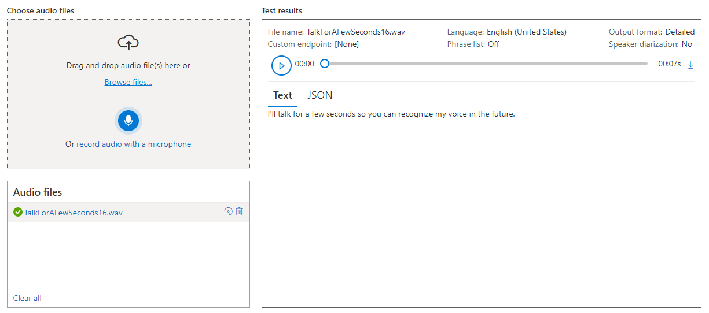

# Explorando o Language Studio e o Speech Studio da Azure

## Proposta

Utilização do recurso Language Studio e o Speech Studio da Azure para realizar as seguintes tarefa de analise:

- Language Studio. Extrair informações como opiniões e sentimentos (positivo, negativo ou neutro) de texto (informação não estruturada) visando sua classificação a opinião do usuário em relação à um serviço ou objeto.
- Speech Studio. Transcrição de audio em tempo real.

## Passo a passo

Vamos seguir a documentação do Microsoft Learn e ao longo do texto serão feitos comentários sobre o processo para esclarecer possíveis dúvidas. A referencia principal é a documentação:

- [Explore Speech Studio](https://microsoftlearning.github.io/mslearn-ai-fundamentals/Instructions/Labs/09-speech.html)
- [Analyze text with Language Studio](https://microsoftlearning.github.io/mslearn-ai-fundamentals/Instructions/Labs/06-text-analysis.html)

Antes de começar é importante notar que para seguir esse passo a passo é necessário configurar uma conta no Microsoft Azure e criar um workspace. Para tal, a seguinte lista lista de recursos pode ser usada como guia:

- [Criar serviços incluídos com a conta gratuita do Azure](https://learn.microsoft.com/pt-br/azure/cost-management-billing/manage/create-free-services).
- [O que é um workspace do Azure Machine Learning?](https://learn.microsoft.com/pt-br/azure/machine-learning/concept-workspace?view=azureml-api-2)
- [Explore Azure AI Services](https://microsoftlearning.github.io/mslearn-ai-fundamentals/Instructions/Labs/02-content-safety.html)

### Language Studio

#### Ativando o recurso do Language Studio

Vamos começar ativando o recurso **Language service**. As imagens a seguir mostram o passo a passo usual (veja a documentação caso surjam duvidas).

#### Acessando o recurso Language Studio

Tendo ativado o serviço **Language service** podemos seguir para a página do recurso **Language Studio** em [https://language.cognitive.azure.com/](https://language.cognitive.azure.com/) para realizarmos as nossas tarefas. Escolhendo a opção **Analyze sentiment and mine opinions** e seguindo a documentação temos.

Aqui foi utilizado o sample que está no código [sample_analyze_sentiment_with_opinion_mining_async.py](https://github.com/Azure/azure-sdk-for-python/blob/main/sdk/textanalytics/azure-ai-textanalytics/samples/async_samples/sample_analyze_sentiment_with_opinion_mining_async.py). O texto também está disponível em [input.txt](input.txt). Podemos ver que o texto é analisado visando classificar a opinião do autor em positiva, negativa ou neutra sobre os diferente objetos/situações abordadas no texto. Podemos descrever esse processo como a tentativa de extrair informação estruturada (informação que podemos processar) partindo de informação não-estruturada (texto opinativo). Isso é um processo bastante desejado quando temos uma grande quantidade de relatos sobre um serviço ou produto e queremos extrair informações estatísticas desses comentários.

#### Desativando o recurso do Language

Por fim, devemos desativar o recurso.

### Speech Studio

Antes de utilizar o recurso do Speech Studio é necessário ativar o recurso. Para tal, podemos seguir passos similares anterior para a ativação do recurso do Language Studio mas escolhendo o serviço Speech service. Tendo ativado o recurso, podemos acessar o link [https://speech.microsoft.com/portal](https://speech.microsoft.com/portal) e escolher a opção Real-time speech to text para começarmos com a tarefa de transcrição de fala em tempo real.

Aqui foi utilizado como input o seguinte sample de audio

<audio controls src="https://github.com/Azure-Samples/cognitive-services-speech-sdk/blob/master/sampledata/audiofiles/TalkForAFewSeconds16.wav" title="sampledata"></audio>

disponível em [Azure-Samples/sampledata/audiofiles](https://github.com/Azure-Samples/cognitive-services-speech-sdk/tree/master/sampledata/audiofiles). A transcrição ocorreu de maneira gradativa, como é esperado do recurso de transcrição em tempo real.

#### Desativando o recurso do

Não podemos esquecer de desativar os recursos. Esse processo é idêntico ao anterior.

## Comentários finais

Podemos fazer alguns comentários finais sobre os dois recursos vistos aqui.

Primeiro o recurso do **Language Studio**. A parte que vimos do recurso permite extrair uma relação do tipo serviço/produto e opinião (positiva, negativa ou neutra) de textos (comentários ou reviews de usuários). Automatizar esse processo permite que a empresa faça a analise estatística de uma grande quantidade de opiniões. Por exemplo, olhando para o text utilizado podemos imaginar que o resultado permitia montar uma database relacionando elementos como quarto, tempo de serviço, cafe da manha, etc com a classificação positiva, negativa e neutra. Fazendo analise dos termos usados (para juntos sinônimos), isso permitiria focar nos pontos negativos para que esses sejam melhorados, tornando a estadia mais proveitosa para os usuários.

Agora sobre o **Speech Studio**. A parte que vimos do recurso permite fazer transcrições de audio para texto em tempo real e suporta uma grande quantidade de idiomas. Essa automatização pode ser utilizada de muitas formas como por exemplo em transcrições de reuniões e assistentes virtuais pessoais. A combinação do **Speech Studio** e do **Language Studio** pode gerar automações interessantes como a criação de uma forma do usuário dar um review mais rápido e simples na forma de audio que seria processado para transcrição e extração de opinião.
