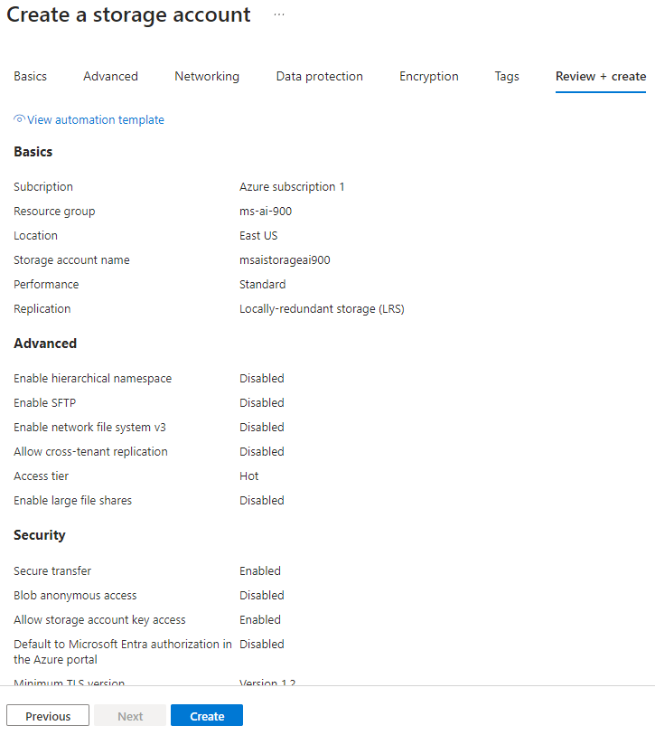

# Explorando a mineração de dados com o Azure Cognitive Search

## Proposta

Utilizar o **Azure AI Search** para indexar automaticamente dados extraídos de documentos (informação não-estruturada). Esse processo consiste em

- Cria os recursos **Azure AI Search**, **Azure AI** e **Azure Storage**
- Fazer a ligação entre os recursos
- Inserir arquivos no **Azure Storage** e realizar a extração dados (indexação)
- Usar a indexação realizada para fazer queries sobre os dados

## Passo a passo

Vamos seguir a documentação do **Microsoft Learn** e ao longo do texto serão feitos comentários sobre o processo para esclarecer possíveis dúvidas. A referencia principal é a documentação:

- [Explore an Azure AI Search index (UI)](https://microsoftlearning.github.io/mslearn-ai-fundamentals/Instructions/Labs/11-ai-search.html)

Antes de começar é importante notar que para seguir esse passo a passo é necessário configurar uma conta no Microsoft Azure e criar um workspace. Para tal, a seguinte lista lista de recursos pode ser usada como guia:

- [Criar serviços incluídos com a conta gratuita do Azure](https://learn.microsoft.com/pt-br/azure/cost-management-billing/manage/create-free-services).
- [O que é um workspace do Azure Machine Learning?](https://learn.microsoft.com/pt-br/azure/machine-learning/concept-workspace?view=azureml-api-2)
- [Explore Azure AI Services](https://microsoftlearning.github.io/mslearn-ai-fundamentals/Instructions/Labs/02-content-safety.html)

### Criação dos recursos

A parte a seguir mostra as principais telas da criação dos três recursos que serão utilizados (**Azure AI Search**, **Azure AI** e **Azure Storage**). É importante ressaltar que todos os recursos devem estar dentro do mesmo grupo de recursos.

#### Azure Ai services


#### Azure Storage services




#### Azure AI Search services


### Configurações e upload de arquivos

Precisamos fazer algumas configurações no **Azure Storage**, para podermos ligar os diferentes recursos, e depois fazer o upload dos arquivos que serão indexados. Seguindo a documentação fazemos a seguinte configuração no **Azure Storage**


Depois criamos um novo container e subimos os arquivos que estão disponíveis na documentação (ou no link [https://aka.ms/mslearn-coffee-reviews](https://aka.ms/mslearn-coffee-reviews))


### Indexação dos documentos

Agora que os arquivos estão no armazenamento da nuvem podemos fazer o processamento pelo **Azure AI Search**. As imagens a seguir mostram as principais telas desse processo.


### Queries

Finalmente com os arquivos processados podemos fazer queries (perguntas) sobre as informações que foram extraídas acessando o **search explorer** do **Azure AI Search**. Esse explorer permite escrever e testar queries diretamente no navegador, um processo necessário para validar os dados extraídos. Podemos inclusive usar json para as pequisas, o que já permite validar implementações de código.


Podemos explorar mais profundamente em um resultado. Fazendo a seguinte pesquisa

```json
{
  "search": "sentiment:'negative'",
  "count": true
}
```

temos

```json
{
  "@odata.context": "https://ms-ai-900-search.search.windows.net/indexes('coffee-index')/$metadata#docs(*)",
  "@odata.count": 1,
  "value": [
    {
      "@search.score": 0.2876821,
      "content": "Review: Today I was truly disappointed with how long I had to wait for the pastries I ordered ahead of time. When I got my box, some of the pastries seemed stale. Terrible experience! \nDate: October 23, 2018\nLocation: Chicago, Illinois \n\n",
      "metadata_storage_path": "aHR0cHM6Ly9tc2Fpc3RvcmFnZWFpOTAwLmJsb2IuY29yZS53aW5kb3dzLm5ldC9jb2ZmZWVyZXZpZXdzL3Jldmlldy04LmRvY3g1",
      "locations": ["Chicago", "Illinois"],
      "keyphrases": [
        "Terrible experience",
        "Review",
        "pastries",
        "time",
        "box",
        "Date",
        "October",
        "Location",
        "Chicago",
        "Illinois"
      ],
      "sentiment": "[\"negative\"]",
      "merged_content": "Review: Today I was truly disappointed with how long I had to wait for the pastries I ordered ahead of time. When I got my box, some of the pastries seemed stale. Terrible experience! \nDate: October 23, 2018\nLocation: Chicago, Illinois \n\n",
      "text": [],
      "layoutText": [],
      "imageTags": [],
      "imageCaption": []
    }
  ]
}
```

Destrincando a resposta temos

- 1 resultado foi achado
- O conteúdo é: <code>Review: Today I was truly disappointed with how long I had to wait for the pastries I ordered ahead of time. When I got my box, some of the pastries seemed stale. Terrible experience! \nDate: October 23, 2018\nLocation: Chicago, Illinois \n\n</code>
- Localização: <code>"Chicago", "Illinois"</code>
- Keyphrases (frases-chave): <code>"Terrible experience", "Review", "pastries", "time", "box", "Date", "October", "Location", "Chicago", "Illinois"</code>
- Sentimento: <code>negative</code>
- Conteúdo resumido (merged_content): <code>"Review: Today I was truly disappointed with how long I had to wait for the pastries I ordered ahead of time. When I got my box, some of the pastries seemed stale. Terrible experience! \nDate: October 23, 2018\nLocation: Chicago, Illinois \n\n"</code>

Utilizando informações estruturadas como essa podemos extrair várias informações estatísticas, montar estrategias de negocio e propaganda, melhorar principais problemas existentes no negocio, etc.

### Informações extraídas

Podemos explorar as informações que foram extraídas dos arquivos que inserimos na nuvem. Acessando o Container e seguindo a documentação temos


Isso é, além dos dados serem processados para extração de informações, temos a organização delas, o que abra para mais possibilidades de uso dessa solução na nuvem.

### Desativando o recurso

Não podemos esquecer de desativar os recursos. Esse processo é idêntico ao anterior.

### Resumo

O sistema de inteligencia artificial que foi criado permite a automação da extração de informações de arquivos não-estruturados. Isso acontece pois fizemos a conexão entre o repositório de arquivos, o serviço de processamento de dados e o serviço de procura por informações. O ambiente Azure permite montar essa estrutura de forma simples e rápida além de permitir testar/validar o as pesquisas nos dados indexados. Isso é, podemos montar o sistema todo, validar e depois fazer a integração com uma outra aplicação.
